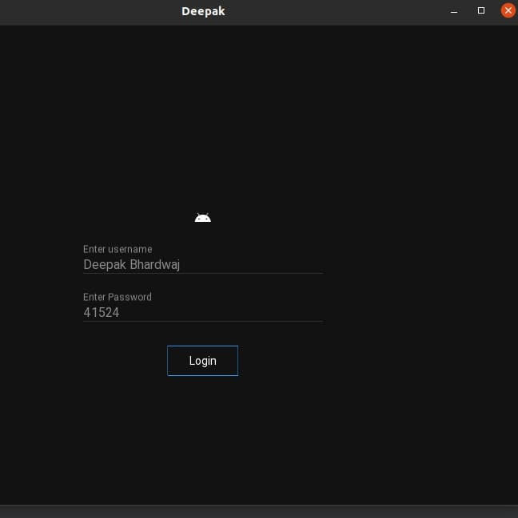
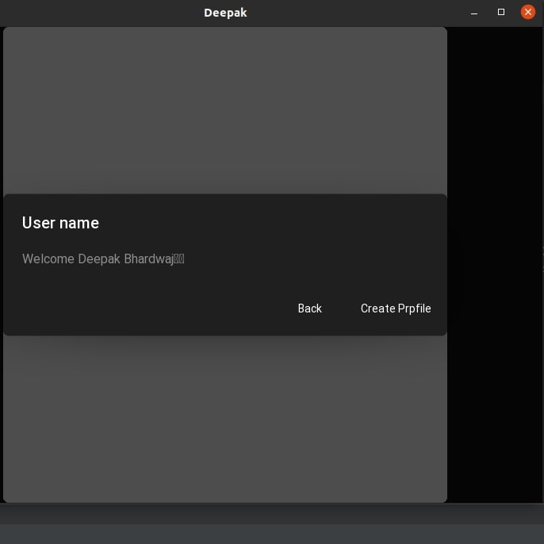
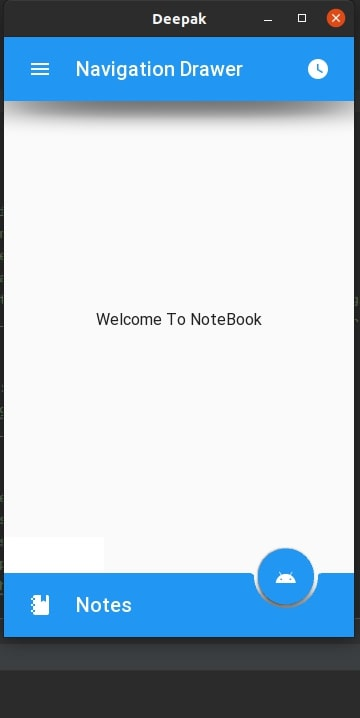
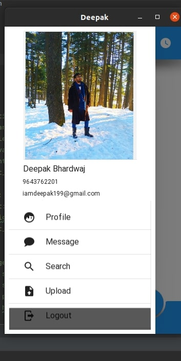

# Notemaking_App
The main advantage of note-taking applications is that notes can be shared between students and teachers. These notes can serve as reminders to complete assignments or as a pedagogical tool to elaborate on in-class lectures, create discussion questions, and more.
   

  
  

  
  

   

  

